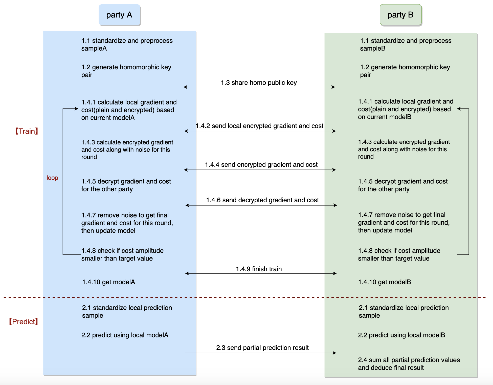

# PaddleDTX Crypto
Crypto is the cryptography module of PaddleDTX with multiple machine learning algorithms and their distributed implementation.

We currently released **Vertical Federated Learning** protocols, including **Multivariate Linear Regression** and **Multivariate Logistic Regression**.
Secret sharing, oblivious transfer, additive homomorphic encryption and private set intersection protocols are also supported, which are tools that federated learning relies on.

## Machine Learning Algorithms
### Multivariate Linear Regression
Multivariate linear regression describes the scene that a variate is affected by multiple factors, and their relation can be expressed by a linear equation. 
For example, the price of a house is affected by house size, number of floor and surrounding environment.  

The model of multivariate linear regression can be expressed as follows:

y = &theta;0 + &theta;1X1 + &theta;2X2 + ... + &theta;nXn

The target feature value is calculated by multiplying n factors with their coefficients and then adding a constant. The training process is to look for optimal coefficients by iteration to ensure errors on training samples is as small as possible. 

### Multivariate Logistic Regression
Different from multivariate linear regression, target feature value in multivariate logistic regression is discrete, often defined as {1,0}, which indicates whether a sample is the specified value.
For example, we can train a model by Iris Plants samples to determine whether a given sample is Iris-setosa.

The model of a multivariate logistic regression can be expressed as follows(Sigmoid function):

y = 1 / (1 + e-&theta;X)

The model is based on multivariate linear regression model. It is continuously differentiable and ensures that target feature value is always between (0,1).
The closer to 1, the greater the possibility it is the specified value. The training process is to look for optimal coefficients &theta; by iteration to ensure errors on training samples is as small as possible. 

## Vertical Federated Learning Algorithms
The project currently supported two-party vertical federated learning protocol. 
In training process, each party calculates partial gradient and cost using own samples. Intermediate parameters are exchanged and integrated to obtain each party's model without leaking any data confidentiality.
In prediction process, each party calculate local result using own model and deduce final result by the sum of all partial results.

Two parties' sample numbers in training or prediction process may be different.
Samples need to be aligned by ID list of each party. Please referr to [psi](./core/machine_learning/linear_regression/gradient_descent/mpc_vertical/psi.go) for more details about sample alignment.  

The vertical federated learning steps of linear and logistic regression are shown as follows, suppose sample alignment has already been finished:

### Training Process
#### Sample Standardization and Preprocessing
Sample standardization and preprocessing is to make sample value changes of each feature in a fixed range. It will improve the model convergence speed and facilitate generalization calculations. 
Especially when there is big difference in sample values of each feature, it is best to preprocess data by standardization.

#### Homomorphic Keys Generation
The intermediate parameters in vertical federated learning process are encrypted and exchanged using the Paillier additive homomorphic algorithm.
Paillier enables us to do addition or scalar multiplication on ciphertext directly. Each party generates own homomorphic key pair and shares the public key.

#### Iteration
Training is an iterated process to get optimal model parameters. The project uses the gradient descent method for training iteration.

- **local gradient and cost**: each party calculates local gradient and cost based on the initial model, or the model from last round, then encrypts gradient and cost by the other party's public key and transfers;

- **encrypt gradient and cost**: each party integrates the other party's ciphertext and local plaintext to calculate final encrypted gradient and cost by the other party's public key. Gradient and cost are garbled using random noises;

- **decrypt gradient and cost**: each party decrypts gradient and cost for the other party. This process will not reveal data confidentiality because of the use of random noise;

- **recover gradient and cost**: each party retrieves plain gradient and cost by removing the noise, and then calculates and updates local model for this round;

- **end of iteration**: the project uses cost amplitudes to determine whether iteration should be stopped. When difference of two continious costs is smaller than target value, iteration will be ended.

#### Generalization
The main challenge of machine learning is that trained model must behave properly on unobserved samples. So the model needs to have generalization ability.
The project supported L1(Lasso) and L2(Ridge) regulation modes. Please refer to [algorithm implementation](./core/machine_learning) for more details about generalization.

### Prediction Process
#### Sample Standardization
The model vertical training process obtained is a model without destandardization. To predict, each party needs to standardize local prediction samples using own model first. 

#### Local Prediction
Each party predicts using local model and standardized samples to get partial result.

#### Result Deduction
One party gathers and sums all partial prediction results, then deduces final result according to different machine learning algorithm.
For linear regression, destandardization is a necessary process after getting the sum of all results. This process is only able to be done by the party which has labels, so all partial results will be sent to that party.

## Examples
The project provided complete test cases and step-by-step instructions. Please refer to [machine learning tests](./test/ml) for more about test codes and data.
